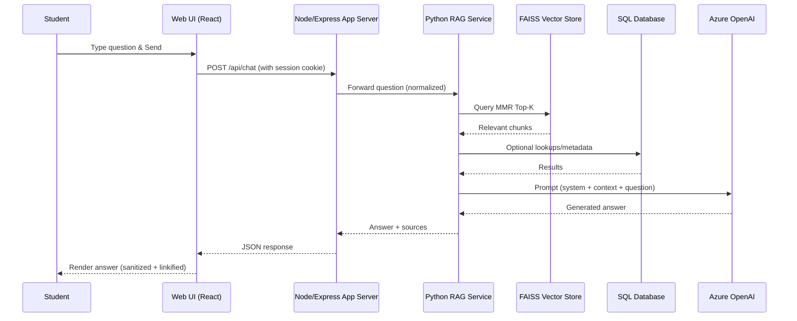
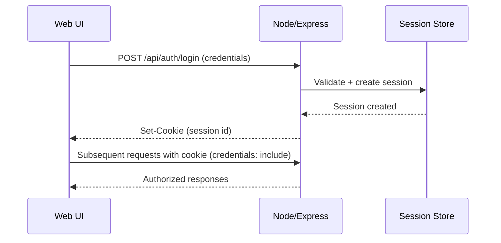

# System Diagrams (Updated)

These diagrams align with the current application architecture: React web UI, Node/Express app server (sessions, REST, WebSockets, recommendations, documents/SAS), Python RAG service (FAISS retriever + Azure OpenAI), Azure Blob Storage, and SQL where applicable. GitHub and VS Code can render Mermaid.

Tip: In VS Code, install a Mermaid preview extension or view on GitHub. To export images locally: `npx @mermaid-js/mermaid-cli -i input.md -o out/`.

---

## 1) Context Diagram
```mermaid
flowchart LR
  Student((Student))
  WebUI[Web UI (React)]
  Node[Node/Express App Server\n(REST, Session Auth, WS, Recs, Docs)]
  RAG[Python RAG Service\n(FAISS retriever + Azure OpenAI)]
  SQL[(SQL Database)]
  VS[(FAISS Vector Store)]
  AOAI[[Azure OpenAI]]
  Blob[(Azure Blob Storage)]
  Sources[[University Sources (External)]]

  Student --> WebUI
  WebUI -->|Credentialed requests (session cookie)| Node
  Node <-->|WebSocket notifications| WebUI

  Node -->|/api/chat (RAG)| RAG
  RAG -->|retrieve context| VS
  RAG -->|metadata/lookups| SQL
  RAG -->|prompt with context| AOAI
  AOAI --> RAG

  Sources -->|ingestion| VS
  Node -->|SAS tokens| Blob
  Blob -->|signed URLs| WebUI
```

---

## 2) System Data Flow (Chat)
```mermaid
flowchart TD
  A[Receive & Parse Input] --> B[Intent Detection\n(chat QA / recommendations / docs)]
  B --> C[Process Query (RAG / Logic)]
  C --> D[Retrieve Context via RAG\n- Normalize query\n- MMR Top-K from FAISS]
  D --> E[Construct Prompt\n- System message\n- Retrieved chunks\n- User question]
  E --> F[Azure OpenAI]
  F --> G[Post-process\n- Sanitize output\n- Linkify URLs\n- Separate Sources]
  G --> H[Generate & Send Response]
```

---

## 3) User Interaction Overview
```mermaid
flowchart LR
  U((Student))
  Chat[Interact with AI Chatbot]
  Ans[Receive Context-Aware Answers]
  Sys[System (Node/Express + Python RAG)]
  KB[Retrieve Data from Knowledge Base]
  Search[Perform Smart Search]
  Filter[Filter Search Results]
  Recs[View Course Recommendations]
  Pers[View Personalized Suggestions]
  Docs[Manage Mandatory Documents]
  SAS[View/Upload via SAS Links]
  Notif[View Notifications]

  U --> Chat --> Ans
  Chat --> Sys --> KB
  U --> Search --> Filter
  U --> Recs --> Pers
  U --> Docs --> SAS
  U --> Notif
```

---

## 4) Chat Sequence (End-to-End)


---

## 5) RAG Pipeline Flow
```mermaid
flowchart TD
  S[Start: User Query] --> P[Pre-process\n- normalize text\n- detect intent]
  P --> Q[Query FAISS Vector Store\n- cosine + MMR]
  Q --> K[Retrieve Top-K Chunks]
  K --> M[Construct Prompt\n- system rules\n- chunks\n- question]
  M --> O[Azure OpenAI]
  O --> X[Post-process\n- sanitize (no bold, strip inline Sources)\n- linkify URLs]
  X --> R[Return Final Response]
  R --> E[End]
```

---

## 6) Course Recommendations Flow
```mermaid
flowchart LR
  UI[Recommendations UI] -->|GET /api/recommendations\n(credentialed)| API[Node/Express]
  API --> Prof[Load Profile (program, semester, completed)]
  Prof --> Filter[Filter Candidates\n- required semester or targetSemester\n- exclude completed\n- prerequisites satisfied]
  Filter --> Score[Score & Select under credit cap\n- preferElectives toggle supported]
  Score --> Resp[Return list + reasons + semester]
  Resp --> UI
```

---

## 7) Mandatory Documents (SAS) Flow
```mermaid
flowchart LR
  DocUI[Documents UI] -->|GET list (credentialed)| Node
  Node --> List[Compute mandatory list / status]
  List --> DocUI
  DocUI -->|Request SAS for upload/view| Node
  Node --> BlobAPI[Azure Blob: generate SAS]
  BlobAPI --> Node --> DocUI
  DocUI -->|Use SAS URL| Blob[(Blob Storage)]
```

---

## 8) Session Auth Overview

